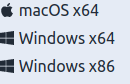
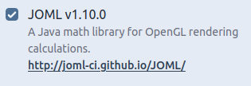
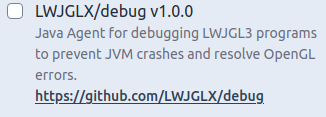

# 1.1 配置环境
## 下载LWJGL
LWJGL提供了一个在线配置库的网址  
[配置网址](https://www.lwjgl.org/customize)  
当然，这么多配置选项，不给点建议你肯定会懵圈  
###
首先是**Show description**开关，对，就是这个  
   
这个开关用于负责解释这些奇奇怪怪的选项是什么意思  
如果英文足够好，可以选择开这个开关然后根据内容自己选  
难度约等于初三英语考试  
###
然后是**Mode**选项  

第一个是以**压缩文件**形式打包下载  
第二个是用**Maven**来自动下载依赖  
第三个是用**Gradle**来自动下载依赖  
第三个是用**Apache Ivy**来自动下载依赖  
**Option**选项因Mode而异  
不过想必大家都能看懂  
###
接下来是**Natives**选项  
因为关于图形渲染的库必定与平台有关  
所以要你选择你的游戏可能会发布到的平台  
一般而言，勾选这三个就可以了  
   
如果你想，可以试试全选  
###
之后是**Presets**选项  
选择**Custom**  
###
现在是**Addons**选项  
建议选择JOML与LWJGLX/debug  
   
   
一个是数学库（到后面数学是真的重要），一个是调试库  
###
**Version**选择**3.2.3**
###
最后是**Contents**  
我一般选择  
- Assimp
- glfw
- LLVM
- LZ4 或 ZStandard
- OpenAL
- OpenGL
- STB
- Vulkan
- Vulkan Memory Allocator
其中强烈推荐（几乎必不可少)
- Assimp
- glfw
- OpenAL
- OpenGL
- STB

## 配置环境
在**Mode**中选择**压缩文件**的根据自己的IDE配置
剩下的则把对应的文件（如*build.gradle*）复制到项目根目录下