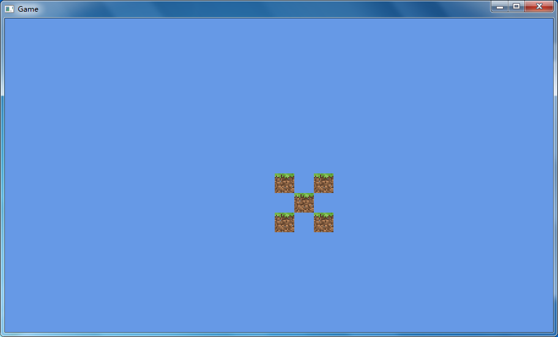
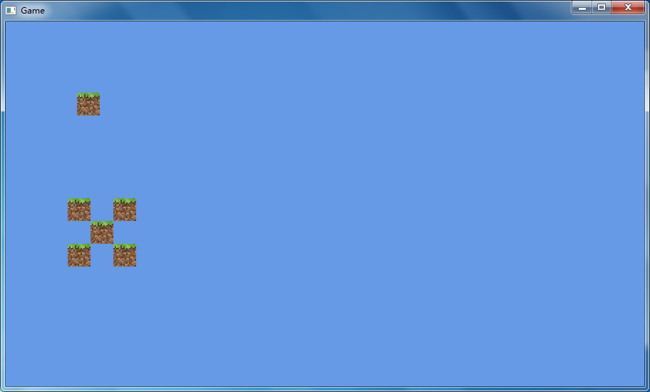

# HUD

[上一节](camera.md)

在本章中我们将实现绘制HUD。  
~~鱿鱼~~由于HUD不能随摄像机移动，因此我们将创建一个“~~摄像机矩阵~~”。
```java
private final Matrix4f projMatrix = new Matrix4f();
private final Matrix4f modelMatrix = new Matrix4f();
```
我们将在java代码中进行相乘。
```java
    public Matrix4f getProjMatrix(float w, float h, GameObject object) {
        return projMatrix.setOrtho2D(0, w, h, 0)
                .translate(object.getPrevX(), object.getPrevY(), 0);
    }

    public Matrix4f getProjModelMatrix(Camera camera, GameObject object, float w, float h) {
        modelMatrix.translation(camera.x,
                camera.y,
                0);
        if (object instanceof Rotatable) {
            modelMatrix.rotateZ(((Rotatable) object).getRotation());
        }
        if (object instanceof Scalable) {
            float scale = ((Scalable) object).getScale();
            modelMatrix.scaleXY(scale, scale);
        }
        return getProjMatrix(w, h, object).mul(modelMatrix);
    }
```
你可以看到我们创建了一个接口。我们之后可以对其扩展。  
我们还对其进行了简化（省略了`identity()`）。

现在多添加一些方块并进行测试：  


现在我们来添加一个不会动的草方块。它的位置始终在`100, 100`。

在渲染器添加hud：
```java
    private Block hud;

        hud = new Block() {
            @Override
            public int getPrevX() {
                return x;
            }

            @Override
            public int getPrevY() {
                return y;
            }
        }.setPos(100, 100).createMesh(program);
```
为了方便，我们使用了`Block`。  
启动后，可以看到草方块固定了位置。  


---
[下一章](../chapter3/worldgen.md)
