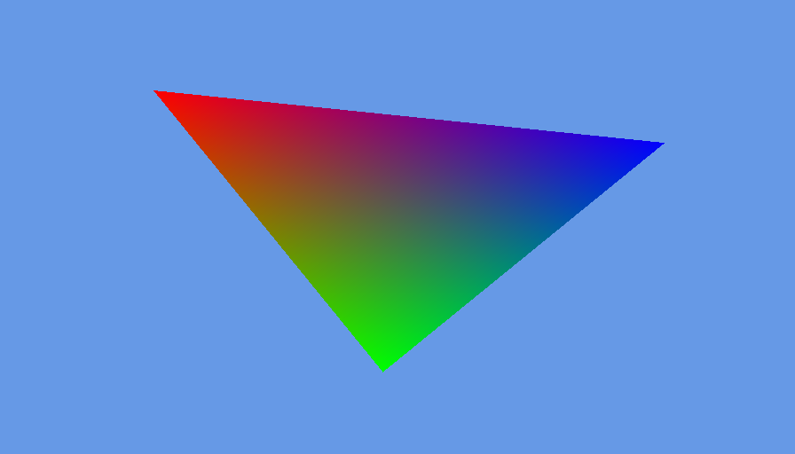

# 着色器（下）

[上一段](shader.md)

**注意：本段与上一段是同一节，因此代码合并。**

在实现移动前，我们先想办法将OpenGL坐标系(-1.0~1)转为屏幕坐标系(0~w,0~h)。

## Transformation 变换

我们将创建一个变换类。它包含一个投影矩阵。并在使用时传入方块以及屏幕宽高。

```java
public final class Transformation {
    private final Matrix4f orthoMatrix = new Matrix4f();

    public Matrix4f getOrthoMatrix(Block block, float w, float h) {
        return orthoMatrix.identity()
                .ortho2D(0, w, h, 0)
                .translate(block.x, block.y, 0)
                .rotateZ(block.rotation)
                .scaleXY(block.scale, block.scale);
    }
}
```
可以看到，这和我们的传统操作非常类似。
```java
glLoadIdentity();
glOrtho(0, w, h, 0, 1, -1);
glTranslatef(block.x, block.y, 0);
glRotatef(block.rotation, 0, 0, 1);
glScalef(block.scale, block.scale, 0);
```

## 使用

在完成后，我们需要修改vsh。
```glsl
#version 110

attribute vec2 vert;
attribute vec3 in_color;
varying vec3 out_color;
// 你可以看到我们添加了一个矩阵。
uniform mat4 orthoMatrix;

void main()
{
    // 该矩阵将对vert进行乘法操作。
    gl_Position = orthoMatrix * vec4(vert, 0, 1);
    out_color = in_color;
}
```
我们还需要修改`GlProgram`。  
为了避免反复获取`uniform`的位置，我们添加一个`Map`。  
我们还添加了两个方法，用于获取和设置我们的`uniform`。
```java
private final Map<String, Integer> uniforms = new HashMap<>();
public int getUniform(String name) {
    return uniforms.computeIfAbsent(name, s -> {
        int loc = (glGetUniformLocation(programId, s));
        if (loc < 0) {
            throw new IllegalArgumentException("Couldn't find uniform: " + s);
        }
        return loc;
    });
}
public void setUniform(String name, Matrix4f matrix4f) {
    try (MemoryStack stack = MemoryStack.stackPush()) {
        glUniformMatrix4fv(getUniform(name),
                false,
                matrix4f.get(stack.mallocFloat(16)));
    }
}
```
现在可以使用了。我们在`GameRenderer`中实例化我们的`Transformation`，并在渲染时获取矩阵。  
我们还需要修改顶点位置以对应屏幕坐标系。
```java
float[] vertices = {
    // 左上
    0, 0,
    // 左下
    0, 256,
    // 右下
    256, 256,
};
```
我们将在`program#bind`之后设置`uniform`。
```java
program.setUniform("orthoMatrix",
        transformation.getOrthoMatrix(block, window.getWidth(), window.getHeight()));
```
一切准备就绪。~~坐和放宽。~~我们只需要处理键盘输入即可测试三角形的移动、旋转和缩放。  
我们将看到如下图：  


---
在示例代码中，我们已经部分实现了[摄像机](camera.md)的功能。只是我们按下键盘时会把三角形的坐标改变。

---
[下一节](texture.md)
