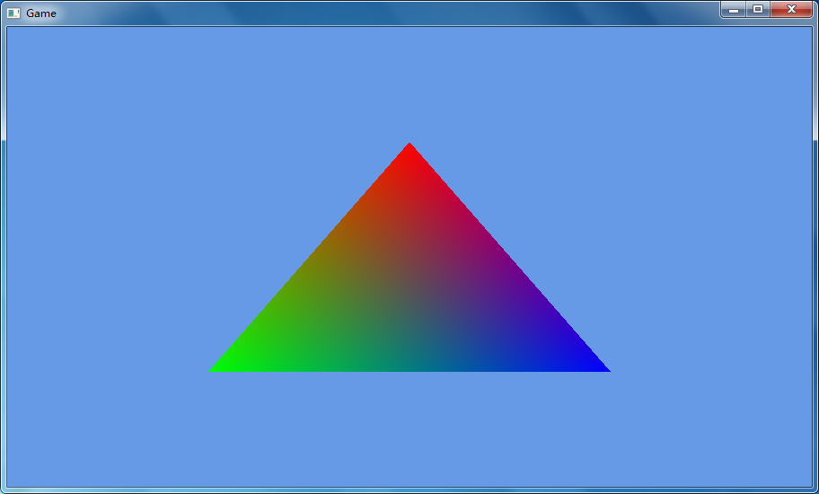

# 着色器

[上一节](hello_triangle.md)
 
本节的源码可在[shader-src](shader-src)中找到。

在开始前，我们先列出想要实现的功能。
- 一个鲜艳的三角形
- 可以移动（类似于`glTranslate*`）
- 可以缩放（类似于`glScale*`）
- 可以旋转（类似于`glRotate*`）

现在可以开工了。

## 一个鲜艳的三角形

在开始前，我们先把代码整理下（乱糟糟的代码总是不好。如果需要详细信息请查看源码）。

首先创建一个接口。该接口包含游戏逻辑。
```java
public interface IGameLogic {
    void init();

    void input(Window window);

    void update(float delta);

    void render(int mouseX, int mouseY);
}
```
然后把GLFW初始化代码放到`Window`类下。  
之后我们需要一个`GameRenderer`负责渲染。  
最后我们创建`DummyGame`来实现`IGameLogic`，并由`GameEngine`托管。

打开后，你会得到一个无聊的黑色窗口。

### 编写着色器

为了能在窗口中显示图像，我们需要至少2个着色器：顶点着色器(vertex shader(vsh))和片元着色器(fragment shader(fsh))。  
vsh示例很简单：
```glsl
#version 110

in vec2 vert;

void main()
{
    gl_Position = vec4(vert, 0, 1);
}
```
fsh也类似：
```glsl
#version 110

void main()
{
    gl_FragColor = vec4(1, 0, 0, 1);
}
```

- `#version 110`代表了着色器的版本（此处为GLSL 1.1)
- `in vec2 vert;`代表输入一个二维向量vert， 即顶点位置
- `void main()`是着色器程序的入口。与C不同，这里的`main`不需要返回值。
- `gl_Position`是一个特殊变量，OpenGL会从这里读取顶点位置
- `gl_FragColor`是一个特殊变量，OpenGL会从这里读取片段颜色

以上着色器将在`vert.x, vert.y`处显示一个红色的图形。

让我们读取这些着色器吧。

---

我们将创建一个`GlProgram`类来创建program并读取着色器。  
> 建议不要翻译program。

```java
public final class GlProgram {
    private final int programId = glCreateProgram();

    public GlProgram() {
        if (programId == 0) {
            throw new NullPointerException("Failed to create GL program");
        }
    }
}
```

`GlProgram`包含program的ID，当ID为`NULL`时会抛一个NPE。  
它还包含一系列方法，用于快速创建着色器、使用program以及清理内存等。

当完成后，我们就可以真正开始使用着色器了。

首先修改顶点着色器。
```glsl
#version 110

attribute vec2 vert;
attribute vec3 in_color;
varying vec3 out_color;

void main()
{
    gl_Position = vec4(vert, 0, 1);
    out_color = in_color;
}
```
这样可以设置颜色。

然后修改片元着色器。
```glsl
#version 110

varying vec3 out_color;

void main()
{
    gl_FragColor = vec4(out_color, 1);
}
```

现在可以对`GameRenderer`进行修改了。  
我们在渲染器中初始化了我们的 program，并且使用它。

<div style="font-size: 2em;">完成了吗？</div>

当然没有。我们还有vbo和vao没写呢。  
~~鱿鱼~~由于在本教程中我们使用 OpenGL 2.0， 所以我们使用默认的 vao（0）。
<!-- 此处需要更多细节。 -->
我们将在 link the program 后对 vbo 进行初始化。

首先我们需要一份顶点位置的数组。由于这是个三角形，因此我们需要2×3个顶点。
```java
float[] vertices = {
    // 中上
    0, .5f,
    // 左下
    -.5f, -.5f,
    // 右下
    .5f, -.5f
};
```
接着我们将使用`glGenBuffers`生成 vbo。  
然后我们使用`glBindBuffer(GL_ARRAY_BUFFER, vertVbo)`将其绑定到`GL_ARRAY_BUFFER`上。

<!-- Required: glVertexAttribPointer -->

对`colorVbo`也执行同样的操作。

启动后，又会得到一个鲜艳的三角形。  


---

<div style="font-size:5em">TODO</div>

---
[下一节](texture.md)
