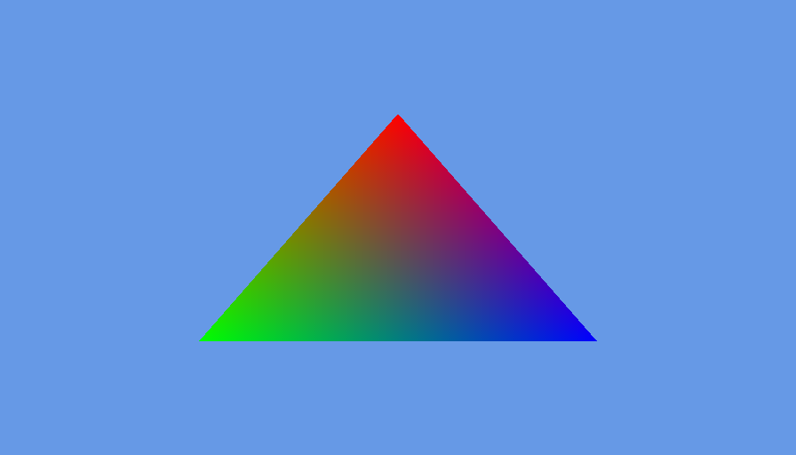

# 着色器（上）

[上一节](hello_triangle.md)
 
本节的源码可在[shader-src](shader-src)中找到。

在开始前，我们先列出想要实现的功能。
- 一个鲜艳的三角形
- 可以移动（类似于`glTranslate*`）
- 可以缩放（类似于`glScale*`）
- 可以旋转（类似于`glRotate*`）

现在可以开工了。

## 一个鲜艳的三角形

在开始前，我们先把代码整理下（乱糟糟的代码总是不好)。不给出太多的实现，如果需要详细信息请查看源码。

首先创建一个接口。该接口包含游戏逻辑。
```java
public interface IGameLogic {
    void init();

    void input(Window window);

    void update(float delta);

    void render(int mouseX, int mouseY);
}
```  
再创建一个Window类：  
```java
public final class Window {
    private final String title;

    private int width, height;

    private long handle;

    private boolean resized;

    public Window(String title, int width, int height);
    public void init();

    public boolean isKeyPressed(int key);

    public boolean shouldClose();

    public void update();

    public String getTitle();

    public int getWidth();

    public int getHeight();

    public boolean isResized();

    public void setResized(boolean resized);
}
```  
然后把GLFW初始化代码放到`Window`类下。  
之后创建一个`GameRenderer`负责渲染。  
```java
public final class GameRenderer {
    public void init();
    public void render();
}
```  
最后我们创建`DummyGame`来实现`IGameLogic`，并由`GameEngine`托管。
```java
public final class DummyGame implements IGameLogic {
    private final GameRenderer renderer = new GameRenderer();

    @Override
    public void init();

    @Override
    public void input(Window window);

    @Override
    public void update(float delta);

    @Override
    public void render(Window window);
}
```  
```java
public final class GameEngine implements Runnable {
    private final Window window;
    private final IGameLogic logic;
    private final Timer timer = new Timer();

    public GameEngine(String title, int width, int height, IGameLogic logic);

    public void init();

    public void input();

    public void update(float delta);

    public void render();

    private void loop();

    @Override
    public void run();
}
```  
打开后，你就可以得到一个无聊的黑色窗口了。

### 编写着色器

为了不使用固定管线而在窗口中显示图像，我们需要至少2个着色器：顶点着色器(vertex shader(vsh))和片元着色器(fragment shader(fsh))。  
当然，你还会遇到几何着色器(geomety shader gsh)。  
vsh示例很简单：  
(item.vsh)  
```glsl
#version 110

in vec2 vert;

void main()
{
    gl_Position = vec4(vert, 0, 1);
}
```
fsh也类似：  
(item.fsh)  
```glsl
#version 110

void main()
{
    gl_FragColor = vec4(1, 0, 0, 1);
}
```

- `#version 110`代表了着色器的版本（此处为GLSL 1.1)
- `in vec2 vert;`代表输入一个二维向量vert， 即顶点位置
- `void main()`是着色器程序的入口。与C不同，这里的`main`不需要返回值。
- `gl_Position`是一个特殊变量，OpenGL会从这里读取顶点位置
- `gl_FragColor`是一个特殊变量，OpenGL会从这里读取片段颜色 
以上着色器将在`vert.x, vert.y`处显示一个红色的图形。   
显然，我们需要读取着色器并让OpenGL识别它：~~废话~~  
为了方便，我们将创建一个`GlProgram`类来创建program并读取着色器。  
> 建议不要翻译program。
`GlProgram`包含program的ID，当ID为`NULL`时会抛一个NPE。  
它还包含一系列方法，用于快速创建着色器、使用program以及清理内存等。
```java
public final class GlProgram implements Closeable {
    private final int programId = glCreateProgram();
    private int vshId, fshId;

    public GlProgram() {
        if (programId == 0) {
            throw new NullPointerException("Failed to create GL program");
        }
    }

    public void createVsh(String src) {
        vshId = createShader(src, GL_VERTEX_SHADER);
    }

    public void createFsh(String src) {
        fshId = createShader(src, GL_FRAGMENT_SHADER);
    }

    private int createShader(String src, int type) {
        int id = glCreateShader(type);
        if (id == 0) {
            throw new NullPointerException("Failed to create shader (Shader type: "
                    + type + ")");
        }
        glShaderSource(id, src);
        glCompileShader(id);
        if (glGetShaderi(id, GL_COMPILE_STATUS) == GL_FALSE) {
            throw new RuntimeException("Error compiling shader src: " + glGetShaderInfoLog(id));
        }
        glAttachShader(programId, id);
        return id;
    }

    public void link() {
        glLinkProgram(programId);
        if (glGetProgrami(programId, GL_LINK_STATUS) == GL_FALSE) {
            throw new RuntimeException("Error linking GL program: " + glGetProgramInfoLog(programId));
        }
        if (vshId != 0) {
            glDetachShader(programId, vshId);
        }
        if (fshId != 0) {
            glDetachShader(programId, fshId);
        }
        glValidateProgram(programId);
        if (glGetProgrami(programId, GL_VALIDATE_STATUS) == GL_FALSE) {
            System.out.println("[WARN]" + glGetProgramInfoLog(programId));
        }
    }

    public void bind() {
        glUseProgram(programId);
    }

    public void unbind() {
        glUseProgram(0);
    }

    public void enableVertexAttribArray(String name) {
        glEnableVertexAttribArray(glGetAttribLocation(programId, name));
    }

    public void vertexAttribPointer(String name,
                                    int size,
                                    int type,
                                    boolean normalized,
                                    int stride) {
        glVertexAttribPointer(
                glGetAttribLocation(programId, name),
                size,
                type,
                normalized,
                stride,
                0);
    }

    public void disableVertexAttribArrays(String... names) {
        for (String nm : names) {
            glDisableVertexAttribArray(glGetAttribLocation(programId, nm));
        }
    }

    @Override
    public void close() {
        unbind();
        if (programId != 0) {
            glDeleteProgram(programId);
        }
        if (vshId != 0) {
            glDeleteShader(vshId);
        }
        if (fshId != 0) {
            glDeleteShader(fshId);
        }
    }
}
```  
按照惯例，开始解释
```java
    public void createVsh(String src) {
        vshId = createShader(src, GL_VERTEX_SHADER);
    }

    public void createFsh(String src) {
        fshId = createShader(src, GL_FRAGMENT_SHADER);
    }

    private int createShader(String src, int type) {
        int id = glCreateShader(type);
        if (id == 0) {
            throw new NullPointerException("Failed to create shader (Shader type: "
                    + type + ")");
        }
        glShaderSource(id, src);
        glCompileShader(id);
        if (glGetShaderi(id, GL_COMPILE_STATUS) == GL_FALSE) {
            throw new RuntimeException("Error compiling shader src: " + glGetShaderInfoLog(id));
        }
        glAttachShader(programId, id);
        return id;
    }
```  
先创建一个着色器`glCreateShader(type)`  
`glCreateShader`代表创建着色器  
`GL_VERTEX_SHADER`代表顶点着色器  
`glShaderSource`绑定着色器源码  
`glCompileShader`编译着色器  

`glGetShaderi`用于读取着色器状态，这里读取的是编译状态  
当返回值为`GL_FALSE`时，编译不成功  
`glGetShaderInfoLog`获取其状态  
片段着色器以此类推  
program以此类推  
当close被调用时，`glDeleteProgram`和`glDeleteShader`释放内存  
`glUseProgram`使用program

当完成后，我们就可以真正开始使用着色器了。

首先修改顶点着色器。
```glsl
#version 110

attribute vec2 vert;
attribute vec3 in_color;
varying vec3 out_color;

void main()
{
    gl_Position = vec4(vert, 0, 1);
    out_color = in_color;
}
```
这样可以设置颜色。

然后修改片元着色器。
```glsl
#version 110

varying vec3 out_color;

void main()
{
    gl_FragColor = vec4(out_color, 1);
}
```

现在可以对`GameRenderer`进行修改了。  
我们在渲染器中初始化了我们的 program，并且使用它。

<div style="font-size: 2em;">完成了吗？</div>

当然没有。我们还有vbo和vao没写呢。  
~~鱿鱼~~由于在本教程中我们使用 OpenGL 2.0， 所以我们使用默认的 vao（0）。
<!-- 此处需要更多细节。 -->
我们将在 link the program 后对 vbo 进行初始化。

首先我们需要一份顶点位置的数组。由于这是个三角形，因此我们需要2×3个顶点。
```java
float[] vertices = {
    // 中上
    0, .5f,
    // 左下
    -.5f, -.5f,
    // 右下
    .5f, -.5f
};
```
接着我们将使用`glGenBuffers`生成 vbo。  
然后我们使用`glBindBuffer(GL_ARRAY_BUFFER, vertVbo)`将其绑定到`GL_ARRAY_BUFFER`上。

<!-- Required: glVertexAttribPointer -->

对`colorVbo`也执行同样的操作。

启动后，又会得到一个鲜艳的三角形。  


---
[下一段](shader-2.md)
