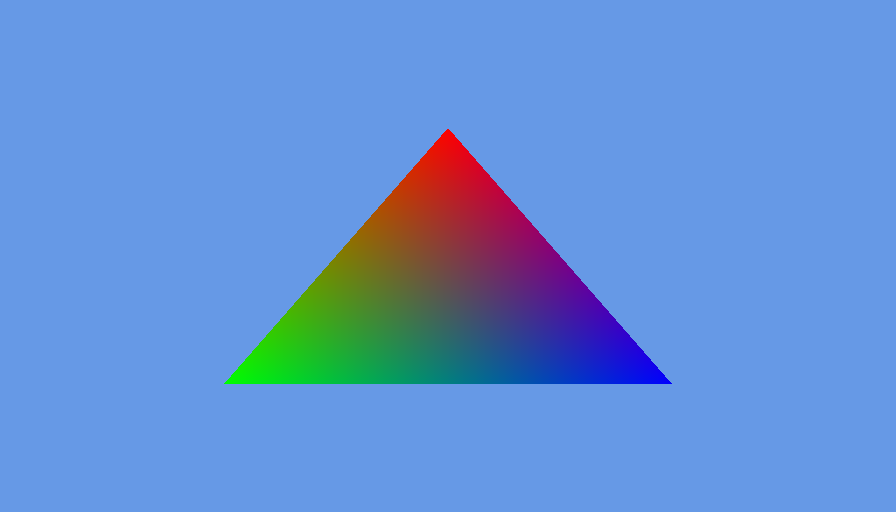
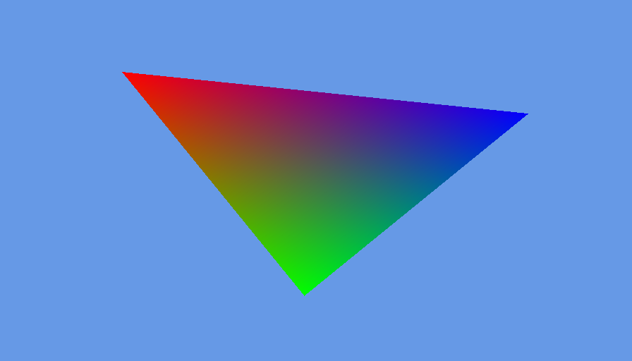

# 着色器（上）

本节的源码可在 [root](https://github.com/Over-Run/lwjgl3-dev-2dgame-tutorial/) 中找到。

在开始前，我们先列出想要实现的功能。

- 一个鲜艳的三角形
- 可以移动（类似于`glTranslate*`）
- 可以缩放（类似于`glScale*`）
- 可以旋转（类似于`glRotate*`）

现在可以开工了。

## 一个鲜艳的三角形

在开始前，我们先把代码整理下（乱糟糟的代码总是不好)。不给出太多的实现，如果需要详细信息请查看源码。

首先创建一个接口。该接口包含游戏逻辑。
```java
public interface IGameLogic {
    void init();

    void input(Window window);

    void update(float delta);

    void render(int mouseX, int mouseY);
}
```  
再创建一个Window类：
```java
public final class Window {
    private final String title;

    private int width, height;

    private long handle;

    private boolean resized;

    public Window(String title, int width, int height);

    public void init();

    public boolean isKeyPressed(int key);

    public boolean shouldClose();

    public void update();

    public String getTitle();

    public int getWidth();

    public int getHeight();

    public boolean isResized();

    public void setResized(boolean resized);
}
```  
然后把GLFW初始化代码放到`Window`类下。

为了方便<del>偷懒</del>，我们使用由我们推出的GLUtils来帮助我们。  
修改`build.gradle`：
```groovy
dependencies {
  implementation "io.github.over-run:glutils:0.3.0"
}
```

之后创建一个`GameRenderer`负责渲染。
```java
public final class GameRenderer {
    public void init();
    public void render();
}
```  
最后我们创建`DummyGame`来实现`IGameLogic`，并由`GameEngine`托管。
```java
public final class DummyGame implements IGameLogic {
    private final GameRenderer renderer = new GameRenderer();

    @Override
    public void init();

    @Override
    public void input(Window window);

    @Override
    public void update(float delta);

    @Override
    public void render(Window window);
}
```  
```java
public final class GameEngine implements Runnable {
    private final Window window;
    private final IGameLogic logic;
    private final Timer timer = new Timer();

    public GameEngine(String title, int width, int height, IGameLogic logic);

    public void init();

    public void input();

    public void update(float delta);

    public void render();

    private void loop();

    @Override
    public void run();
}
```  
打开后，你就可以得到一个无聊的黑色窗口了。

### 编写着色器

为了不使用固定管线而在窗口中显示图像，我们需要至少2个着色器：顶点着色器(vertex shader(vsh))和片元着色器(fragment shader(fsh))。  
当然，你还会遇到几何着色器(geomety shader(gsh))。  
vsh示例很简单：  
(item.vsh)
```glsl
#version 110

in vec2 vert;

void main()
{
    gl_Position = vec4(vert, 0, 1);
}
```
fsh也类似：  
(item.fsh)
```glsl
#version 110

void main()
{
    gl_FragColor = vec4(1, 0, 0, 1);
}
```

- `#version 110`代表了着色器的版本（此处为GLSL 1.1)
- `in vec2 vert;`代表输入一个二维向量vert， 即顶点位置
- `void main()`是着色器程序的入口。与C不同，这里的`main`不需要返回值。
- `gl_Position`是一个特殊变量，OpenGL会从这里读取顶点位置
- `gl_FragColor`是一个特殊变量，OpenGL会从这里读取片段颜色  
  以上着色器将在`vert.x, vert.y`处显示一个红色的图形。

显然，我们需要读取着色器并让OpenGL识别它<del>废话</del>  

由于GLUtils的引入，这里一大段被删了。

首先修改顶点着色器。
```glsl
#version 110

attribute vec2 vert;
attribute vec3 in_color;
varying vec3 out_color;

void main()
{
    gl_Position = vec4(vert, 0, 1);
    out_color = in_color;
}
```
这样可以设置颜色。

然后修改片元着色器。
```glsl
#version 110

varying vec3 out_color;

void main()
{
    gl_FragColor = vec4(out_color, 1);
}
```

现在可以对`GameRenderer`进行修改了。  
我们在渲染器中初始化了我们的 program，并且使用它。

<div style="font-size: 2em;">完成了吗？</div>

当然没有。我们还有vbo和vao没写呢。  
由于在本教程中我们使用 OpenGL 2.0， 所以我们使用默认的 vao(0)。
<!-- 此处需要更多细节。 -->
我们将在 link the program 后对 vbo 进行初始化。

首先我们需要一份顶点位置的数组。由于这是个三角形，因此我们需要2×3个顶点。
```java
float[] vertices = {
    // 中上
    0, .5f,
    // 左下
    -.5f, -.5f,
    // 右下
    .5f, -.5f
};
```
接着我们将使用`glGenBuffers`生成 vbo。  
然后我们使用`glBindBuffer(GL_ARRAY_BUFFER, vertVbo)`将其绑定到`GL_ARRAY_BUFFER`上。

<!-- Required: glVertexAttribPointer -->

对`colorVbo`也执行同样的操作。

启动后，又会得到一个鲜艳的三角形。  


## 矩阵变换

在实现移动前，我们先想办法将OpenGL坐标系(-1.0&sim;1)转为屏幕坐标系(0&sim;w,0&sim;h)。

我们将创建一个变换类。它包含一个投影矩阵。并在使用时传入方块以及屏幕宽高。
```java
public final class Transformation {
    private final Matrix4f orthoMatrix = new Matrix4f();

    public Matrix4f getOrthoMatrix(Block block, float w, float h) {
        return orthoMatrix.identity()
                .ortho2D(0, w, h, 0)
                .translate(block.x, block.y, 0)
                .rotateZ(block.rotation)
                .scaleXY(block.scale, block.scale);
    }
}
```
可以看到，这和我们的传统操作非常类似。
```java
glMatrixMode(GL_PROJECTION);
glLoadIdentity();
glOrtho(0, w, h, 0, 1, -1);
glMatrixMode(GL_MODELVIEW);
glTranslatef(block.x, block.y, 0);
glRotatef(block.rotation, 0, 0, 1);
glScalef(block.scale, block.scale, 0);
```

在完成后，我们需要修改顶点着色器。
```glsl
#version 110

attribute vec2 vert;
attribute vec3 in_color;
varying vec3 out_color;
// 你可以看到我们添加了一个矩阵。
uniform mat4 orthoMatrix;

void main()
{
    // 该矩阵将对vert进行乘法操作。
    gl_Position = orthoMatrix * vec4(vert, 0, 1);
    out_color = in_color;
}
```
现在可以使用了。我们在`GameRenderer`中实例化我们的`Transformation`，并在渲染时获取矩阵。  
我们还需要修改顶点位置以对应屏幕坐标系。
```java
float[] vertices = {
    // 左上
    0, 0,
    // 左下
    0, 256,
    // 右下
    256, 256,
};
```
我们将在`program#bind`之后设置`uniform`。
```java
try (MemoryStack stack = MemoryStack.stackPush()) {
    glUniformMatrix4fv(program.getUniform("orthoMatrix"),
            false,
            transformation.getOrthoMatrix(block, window.getWidth(), window.getHeight())
                    .get(stack.mallocFloat(16)));
}
```
一切准备就绪。<del>坐和放宽。</del>我们只需要处理键盘输入即可测试三角形的移动、旋转和缩放。  
我们将看到下图：  


---
在示例代码中，我们已经部分实现了[摄像机](camera.md)的功能。只是我们按下键盘时会把三角形的坐标改变。
