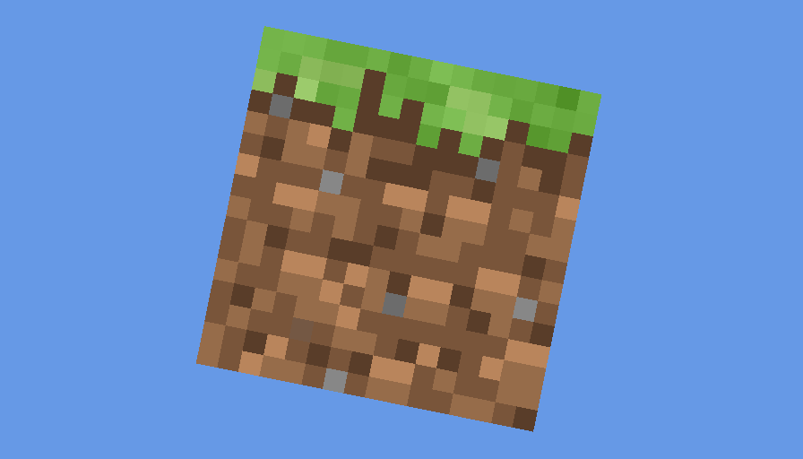

# 纹理

在绘制出纹理前，我们先把三角形变成~~四角形~~四边形。  
我们将把这个四边形看做是两个三角形而不是`GL_QUADS`。

我们将使用`Mesh`来处理。这样便无需让渲染器来处理。

我们还需要修改着色器，以适应新的更改。
```glsl
#version 110

attribute vec2 vert;
attribute vec3 in_color;
// 我们新添了2个成员。
attribute vec2 in_texCoord;
varying vec3 out_color;
varying vec2 out_texCoord;
uniform mat4 orthoMatrix;

void main()
{
    gl_Position = orthoMatrix * vec4(vert, 0.0, 1.0);
    out_color = in_color;
    out_texCoord = in_texCoord;
}
```
```glsl
#version 110

varying vec3 out_color;
varying vec2 out_texCoord;
// 纹理采样器
uniform sampler2D textureSampler;

void main()
{
    // 我们将生成2D纹理并与颜色混合。
    // 这就是为什么在固定管线中调用glColor*(1, 1, 1)的原因。
    // 如果不调用这个函数，那么颜色全部都会乘0，结果为黑色。
    gl_FragColor = texture2D(textureSampler, out_texCoord) * vec4(out_color, 1.0);
}
```

我们还使用了`Textures`类，用于快速创建纹理。

现在我们可以修改渲染器了。  
把之前的vbo代码全部删除，换上全新的`Mesh`。
```java
mesh = Mesh.builder()
        .program(program)
        .vertices(vertices)
        .vertIdx("vert")
        .vertSize(2)
        .colors(colors)
        .colorIdx("in_color")
        .texCoords(texCoords)
        .texIdx("in_texCoord")
        // 由于GLUtils 0.3.0中的bug，我们需要手动设置texSize为2.等0.4.0吧
        .texSize(2)
        .texture(Textures.loadAWT(GameRenderer.class.getClassLoader(),
                "grass_block.png",
                GL_NEAREST))
        .indices(indices)
        .build();
```
你可以看到，我们使用了AWT来读取图片。这是因为stb是本地库，它无法获取与Classpath有关的东西，使我们只能用绝对路径。  
我们使用了一个草方块作为纹理。

然后我们设置`textureSampler`为0：`program.setUniform("textureSampler", 0)`  
接着把`glDrawArrays`替换为`mesh.render()`。  
最后，我们在`close`里释放内存：`mesh.close()`。

启动后，我们会看到一个能动的草方块。  

